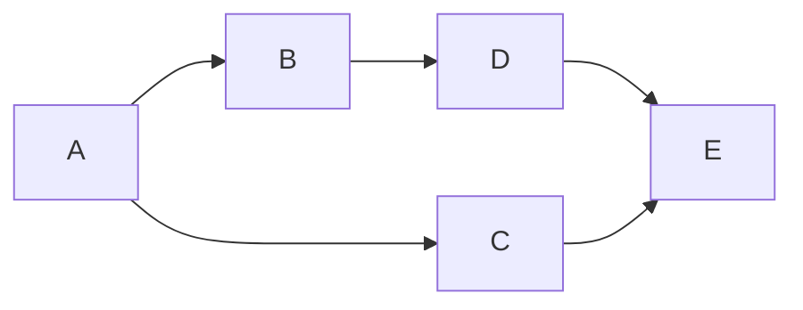
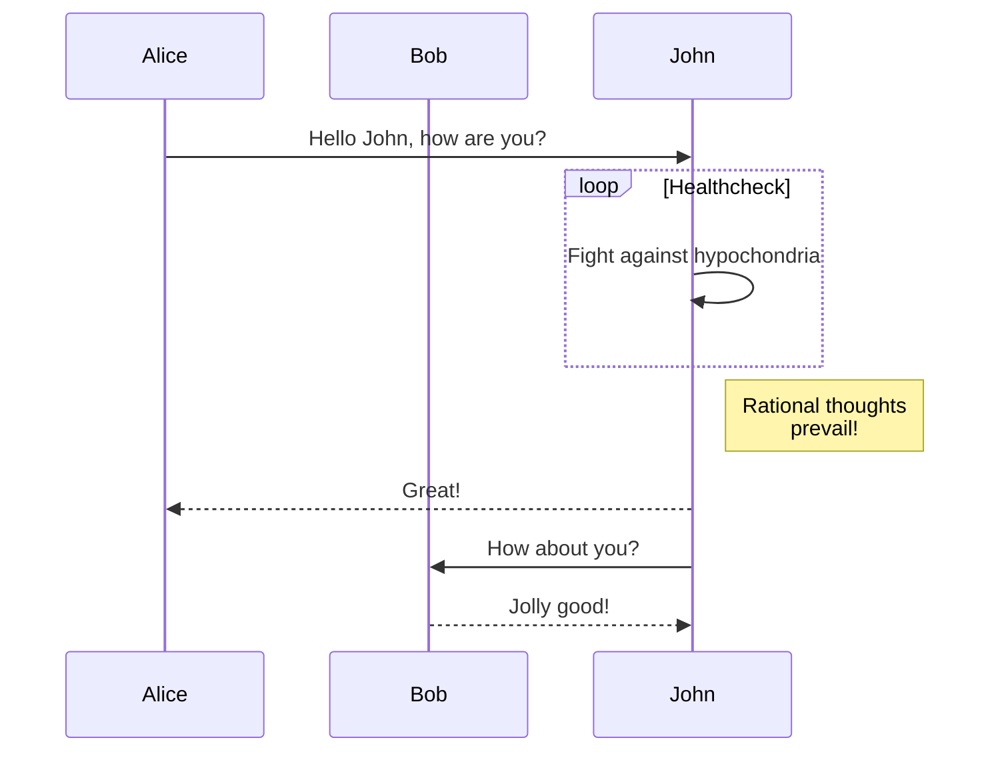

## Mermaid Diagrams

The diagrams are rendered in client side with html inline script. As a result, sometimes it is really slow.

## Dark mode

Now it supports light and dark color mode! You can switch the color mode at the bottom of the TOC.
I tried to render each diagram twice, and then set the opacity of them based on the color mode.
